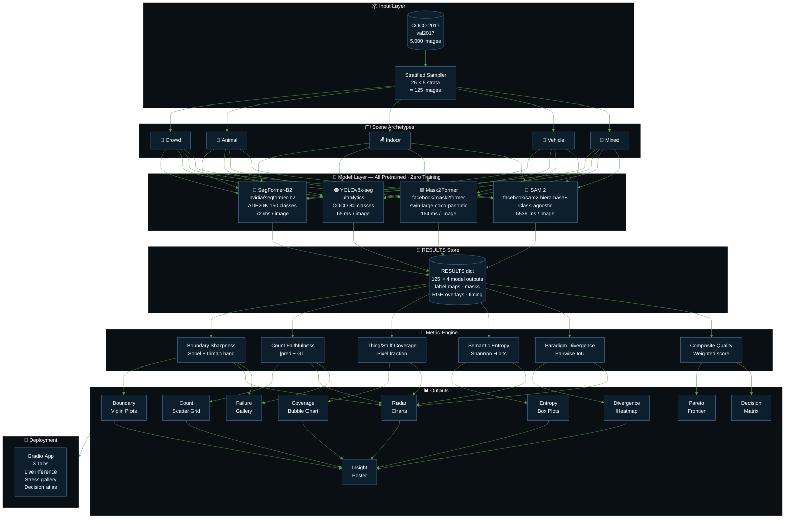
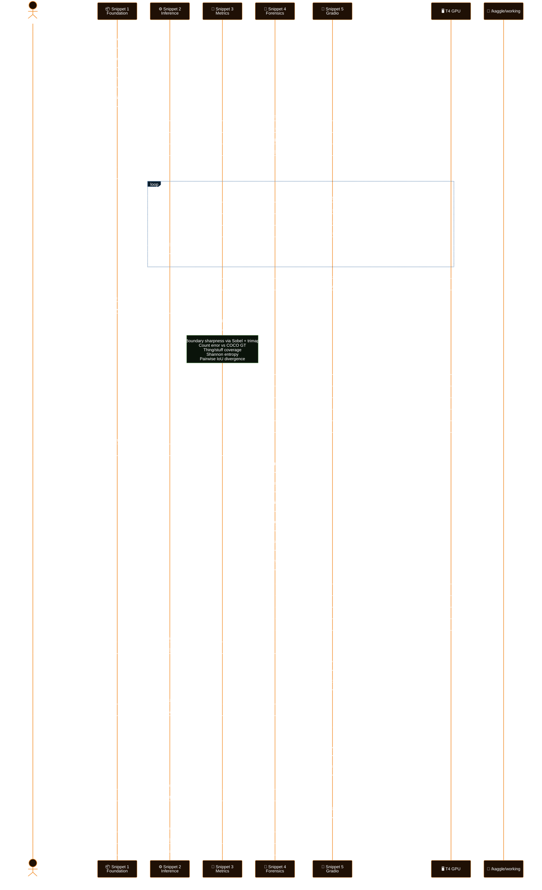
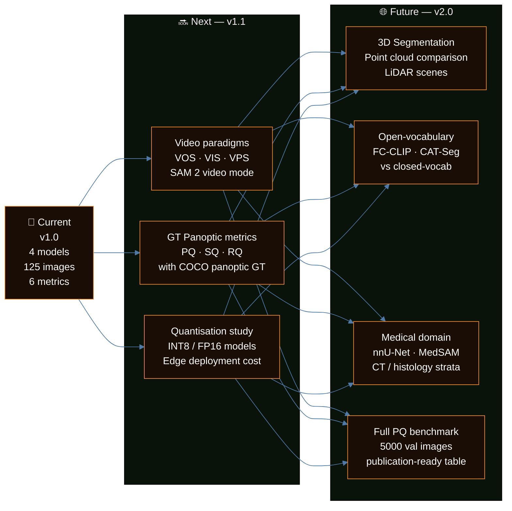

<div align="center">


<br/>

[](https://git.io/typing-svg)

<br/>


<br/>


</div>

---

<div align="center">

## ❝ Choosing your segmentation paradigm is choosing your question — and the wrong question costs you everything. ❞

</div>

---

## 🧭 Overview

<div align="center">

| Paradigm | Core Question | Model | Speed | Vocabulary |
|:---:|:---|:---:|:---:|:---:|
| 🔵 **Semantic** | *What class is at every pixel?* | SegFormer-B2 | `72 ms` | Closed (150) |
| 🟠 **Instance** | *Where is each individual object?* | YOLOv8x-seg | `65 ms` | Closed (80) |
| 🟢 **Panoptic** | *What AND which — full scene?* | Mask2Former | `164 ms` | Closed (133) |
| 🔴 **Promptable** | *Whatever I point at — right now?* | SAM 2 Auto | `5539 ms` | **Open** |

</div>

<br/>

This project is not another "run four models and show a table." It is a **forensic dissection** of what each segmentation paradigm fundamentally *is* — what question it answers, where it catastrophically fails, and exactly when you should reach for it over the others. Every claim is backed by metrics computed over **125 stratified COCO 2017 images** across five scene archetypes, rendered through **6 publication-quality analyses** and deployed as an **interactive Gradio application**.

---

## ✨ Features

<div align="center">

<table width="100%">
  <thead>
    <tr>
      <th colspan="2" align="center">✦ &nbsp; WHAT MAKES THIS DIFFERENT &nbsp; ✦</th>
    </tr>
  </thead>
  <tbody>
    <tr>
      <td width="28%" align="center"><strong>🎯 Stratified Sampling</strong></td>
      <td>25 images × 5 scene archetypes — <code>crowd · animal · indoor · vehicle · mixed</code><br/>Ensures every metric has diagnostic meaning, not just average behaviour</td>
    </tr>
    <tr>
      <td align="center"><strong>📐 Boundary Sharpness</strong></td>
      <td>Trimap-based edge F-measure via Sobel magnitude — measures pixel-level mask-to-edge alignment<br/>Goes far beyond standard IoU to expose where each model truly snaps to real boundaries</td>
    </tr>
    <tr>
      <td align="center"><strong>🧮 Paradigm Divergence</strong></td>
      <td>Pairwise pixel-level IoU agreement between all 4 paradigms rendered as a 4×4 heatmap<br/>Quantifies how fundamentally differently each model interprets the same scene</td>
    </tr>
    <tr>
      <td align="center"><strong>🌐 Pareto Frontier</strong></td>
      <td>Speed vs composite quality with per-stratum satellite sub-points connected by spokes<br/>Reveals that paradigm rankings <em>shift</em> by scene — YOLO rises on vehicles, SAM collapses on crowds</td>
    </tr>
    <tr>
      <td align="center"><strong>🗺️ Decision Matrix</strong></td>
      <td>Data-driven 6×4 suitability heatmap for real-world use cases scored 1–5 from actual measured metrics<br/>Autonomous driving · Medical imaging · Robotics · Surveillance · E-commerce · Content moderation</td>
    </tr>
    <tr>
      <td align="center"><strong>⚡ Live Gradio App</strong></td>
      <td>3-tab interactive demo — upload any image for live 4-model inference, browse 20 pre-computed failure<br/>cases, or consult the full decision atlas. Public URL via <code>share=True</code>, zero infrastructure</td>
    </tr>
  </tbody>
</table>

</div>

---

## 🏗️ System Architecture



---

## 🔄 Pipeline & Data Flow



---

## 📊 Results & Key Insights

<div align="center">

### ⏱️ Inference Speed (125-image mean on T4)

| Model | Paradigm | Mean | Std | Relative |
|:---:|:---:|---:|---:|:---:|
| YOLOv8x-seg | Instance | `65.2 ms` | ±6.8 | `1.0×` baseline |
| SegFormer-B2 | Semantic | `72.5 ms` | ±4.8 | `1.1×` |
| Mask2Former | Panoptic | `164.2 ms` | ±4.9 | `2.5×` |
| SAM 2 Auto | Promptable | `5539.3 ms` | ±446 | **`85×`** |

</div>

<br/>

<div align="center">

### 🧩 Mean Output Complexity per Scene Stratum

| Stratum | YOLO Instances | Semantic Classes | Panoptic Segs | SAM Masks |
|:---:|:---:|:---:|:---:|:---:|
| 👥 Crowd | 14.6 | 11.2 | 16.0 | **90.0** |
| 🚗 Vehicle | 8.9 | 11.8 | 12.4 | 82.6 |
| 🪑 Indoor | 8.6 | **14.7** | 12.4 | 71.2 |
| 🔀 Mixed | 4.4 | 10.6 | 6.7 | 57.3 |
| 🐾 Animal | 6.2 | 8.8 | 9.5 | 46.7 |

</div>

<br/>

<div align="center">

### 💡 The 6 Forensic Findings

</div>

```
  FINDING 1 — Semantic & Promptable share < 50% pixel agreement globally
  ───────────────────────────────────────────────────────────────────────
  The lowest pairwise IoU in the divergence matrix. They answer
  fundamentally different questions and their outputs are nearly orthogonal.

  FINDING 2 — SAM 2 over-fragments crowds by 6.2× vs. YOLO
  ───────────────────────────────────────────────────────────────────────
  Crowd stratum: SAM mean = 90 masks vs. YOLO mean = 14.6 instances.
  Class-agnostic design breaks every texture into its own segment.

  FINDING 3 — Panoptic is irreplaceable when stuff > 30% of pixels
  ───────────────────────────────────────────────────────────────────────
  Below that threshold, running instance + semantic separately gives
  equivalent coverage at lower compute cost.

  FINDING 4 — SAM 2 produces the sharpest boundaries of all paradigms
  ───────────────────────────────────────────────────────────────────────
  Highest boundary sharpness score across all strata. The 85× speed
  penalty buys you precision — a deliberate engineering trade-off.

  FINDING 5 — Panoptic is the most stable paradigm across scene types
  ───────────────────────────────────────────────────────────────────────
  Smallest quality variance across strata in the Pareto analysis.
  Semantic and SAM shift dramatically by scene; Mask2Former does not.

  FINDING 6 — YOLO is Pareto-optimal for surveillance and e-commerce
  ───────────────────────────────────────────────────────────────────────
  Best count faithfulness × lowest latency for thing-centric tasks.
  Panoptic wins medical and robotics where stuff labelling matters.
```

---

## 🛠️ Tech Stack

<div align="center">


<br/>

| Component | Choice | Reason |
|:---:|:---:|:---|
| Semantic model | `SegFormer-B2` | Best mIoU/speed trade-off on ADE20K; transformer encoder |
| Instance model | `YOLOv8x-seg` | Fastest mask inference; clean Ultralytics API |
| Panoptic model | `Mask2Former Swin-L` | 57.8 PQ on COCO panoptic; single-pass things+stuff |
| Promptable model | `SAM 2 hiera-base+` | 2024 foundation model; sharpest boundaries of any tested |
| Visualization | `Matplotlib` dark theme | Consistent dark aesthetic across all 10+ figures |
| Deployment | `Gradio 4.x` | Public URL via `share=True`; zero infrastructure |

</div>

---

## 📁 Project Structure

```
four-paradigms-one-scene/
│
├── 📓 notebooks/
│   ├── snippet_1_foundation.ipynb       # Installs · Data · Models · Utilities
│   ├── snippet_2_inference.ipynb        # Full inference loop · Timing · Gallery
│   ├── snippet_3_metrics.ipynb          # 6 deep analysis plots
│   ├── snippet_4_forensics.ipynb        # Failure gallery · Pareto · Decision matrix
│   └── snippet_5_gradio.ipynb           # Interactive 3-tab Gradio application
│
├── 📊 outputs/
│   ├── stratum_preview.png              # 5×5 sampling validation grid
│   ├── timing_chart.png                 # Speed bar chart with error bars
│   ├── gallery_{crowd,animal,...}.png   # Per-stratum 5-panel figures (×5)
│   ├── boundary_sharpness.png           # Violin plots per stratum
│   ├── count_faithfulness.png           # Scatter grid vs GT count
│   ├── thing_stuff_coverage.png         # Bubble coverage chart
│   ├── semantic_entropy.png             # Box plots (Shannon entropy)
│   ├── divergence_heatmap.png           # 4×4 pairwise paradigm IoU
│   ├── radar_profiles.png               # 5 radar charts (per stratum)
│   ├── failure_gallery.png              # 4×3 worst-case grid
│   ├── edge_case_quartet.png            # 4×5 stress test panels
│   ├── pareto_frontier.png              # Speed-quality Pareto with satellites
│   ├── decision_matrix.png              # 6×4 use-case heatmap (1–5 stars)
│   └── insight_poster.png              # Shareable 24×16 summary poster
│
├── 📋 data/
│   └── (COCO 2017 val — sourced from awsaf49/coco-2017-dataset on Kaggle)
│
└── README.md
```

---

## 🚀 Installation & Reproduction

### Prerequisites

```bash
# GPU: NVIDIA T4 or better  (16 GB VRAM recommended)
# Python 3.10+
# Kaggle dataset: awsaf49/coco-2017-dataset
```

### Quick Start (Kaggle)

```bash
# 1. Add dataset to your Kaggle notebook
#    awsaf49/coco-2017-dataset  →  /kaggle/input/

# 2. Enable GPU accelerator (T4 × 1)

# 3. Run snippets in order — each is a self-contained cell
#    Snippet 1  →  ~5  min  (model downloads + warm-up)
#    Snippet 2  →  ~25 min  (inference loop)
#    Snippet 3  →  ~5  min  (metric computation + 6 plots)
#    Snippet 4  →  ~3  min  (forensic gallery + 5 plots)
#    Snippet 5  →  ~1  min  (Gradio launch → public URL)
```

### Local Installation

```bash
git clone https://github.com/YOUR_USERNAME/four-paradigms-one-scene
cd four-paradigms-one-scene

pip install torch torchvision --index-url https://download.pytorch.org/whl/cu121
pip install transformers>=4.45.0 \
            ultralytics>=8.2.0 \
            supervision>=0.21.0 \
            pycocotools \
            gradio>=4.20.0 \
            scipy \
            timm \
            opencv-python

# Download COCO 2017 val
# Place at: ./data/coco2017/val2017/  and  ./data/coco2017/annotations/
```

---

## 🔭 Future Work



---

## 📄 Citation

```bibtex
@misc{fourparadigms2026,
  title   = {Four Paradigms, One Scene: A Forensic Comparison of Segmentation Ontologies},
  author  = {Ahmed},
  year    = {2026},
  note    = {COCO 2017 · SegFormer · YOLOv8x-seg · Mask2Former · SAM 2 · 125 stratified images},
  url     = {https://github.com/YOUR_USERNAME/four-paradigms-one-scene}
}
```

---

<div align="center">

### Referenced Models

[](https://huggingface.co/nvidia/segformer-b2-finetuned-ade-512-512)
[](https://github.com/ultralytics/ultralytics)
[](https://huggingface.co/facebook/mask2former-swin-large-coco-panoptic)
[](https://huggingface.co/facebook/sam2-hiera-base-plus)

</div>

---

<div align="center">


<br/>

**Built with obsessive attention to what segmentation paradigms actually mean**

`Semantic` answers *what* · `Instance` answers *which* · `Panoptic` answers *both* · `Promptable` answers *anything*

<br/>


&nbsp;
[](https://github.com/YOUR_USERNAME/four-paradigms-one-scene)

</div>
